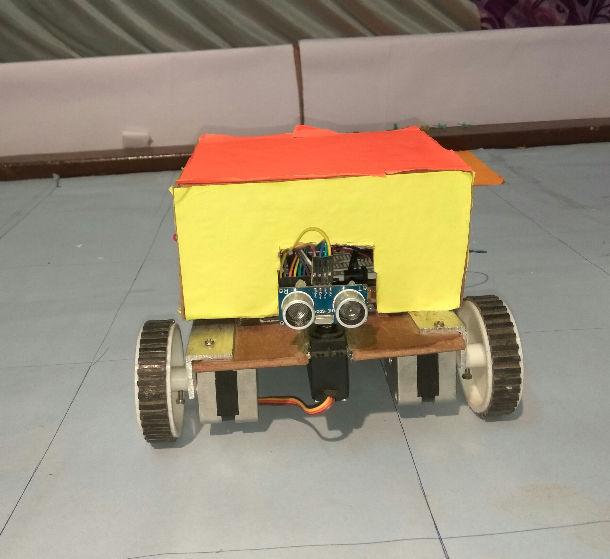

# SURFACE MAPPING BOT
##### Project done in Srishti 2017 (Annual Techno-Hobby Exhibition of IIT Roorkee)

### Abstract
Surface Mapping Bot is an autonomous bot which can move in a specified area and create a 2D map of the whole surface. It can detect the objects and walls that are around it and send their coordinates to the PC via Bluetooth which displays its map on the screen. Ultrasonic sensor is used for the detection of the objects and "Processing" software is used for displaying the map.

### Team Members
1. Rahul Garg
2. Aniket Gajare
3. Rohit Jethani

### Mentors
1. Bhaskar Kaushik
2. Gautham Sriram
3. Aayushi Srivastava

### Pre-requisites

**Software:** 
 * Arduino
 * Processing
 
**Hardware:** 
*	HC-SR04 (Ultrasonic Sensor): For the detection of objects.
*	Servo Motor : To rotate the ultrasonic sensor in three directions
*	Stepper Motors (2): Stepper because we want the bot to cover exact distance at a time. We can also use DC motor with ENCODER.
*	HC-05 (Bluetooth Module): For the wireless Serial Communication.
*	Arduino (2): We used Arduino Uno both sides. You can use any type of Arduino according to mechanics.

 
### How to run the Setup
First put the dimensions of the field in the code, upload it and then switch ON the bot at the corner of the field. Ensure proper pairing of the bluetooth modules and press any key on the keyboard. Servo will start moving and the ultrasonic sensor mounted on it will record the coordinates of the objects and the data will be sent to PC where it will be interpreted to give the required map.

### Applications
*	It can be sent to the places, where human access is not possible, to create a map of the place for further planning.
*	Mine detection robot is based on wireless networks. It can be made using microcontroller for a remote controlled mine detecting robot   using sensors. When an obstacle comes in front of the robot, Infrared or metal sensors senses that obstacle and send appropriate         signal to the microcontroller.
*	It can be used at homes so that it will map the whole house and then we can program it do many activities like autonomous vacuum         cleaning of house, serving food to the guests etc.

### Design
A rectangular wooden board of around 18cm x 15cm is used. The servo is placed on the front side and the ultrasonic sensor is mounted on it. Two Stepper motors are placed under the board and mounted by L-mount on the front side of the bot. A castor wheel is used on the backside for easy navigation. All electronic components are placed on the board with Arduino, breadboard and battery.

### Future Scope
*	We can improve its algorithm to map the whole area without any errors.
*	At present, it can only calculate the distances in three directions (forward, left and right), we can enhance it to measure distances in all directions (360 degree view).

